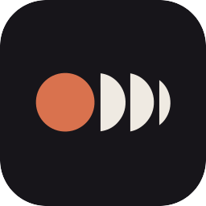
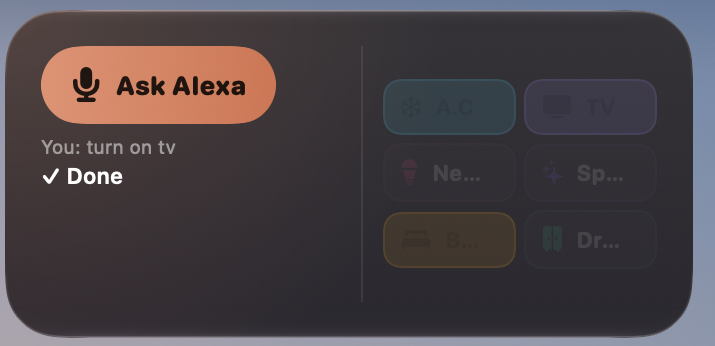

<p align="center">
  
</p>

<h1 align="center">Deck</h1>

<p align="center">
  Alexa moved into my menu bar. My voice moved in with it.<br>
  Hit one key and the lights change. Hold another and whatever I say gets typed.
</p>

<p align="center">
  
  
  
  
</p>

<p align="center">
  <a href="https://github.com/YahyaElghobashy/deck-mac/releases/latest/download/Deck-macOS-arm64.zip">
    
  </a>
</p>

<p align="center">
  
</p>

## Why this thing exists

Alexa has no Mac app. None. On a Mac your options are: talk to a plastic cylinder across the
room, or open your phone like it's 2013. Meanwhile every dictation app wants a monthly fee to
send my voice to someone else's server.

So I built the missing button. Two of them, actually:

- **⌃⌥A** — Deck listens, notices when I stop talking, sends the words to my Echo, and shows me
  what Alexa said back. No screen mirroring, no phone, no "open the app".
- **⌃⌥Z** — hold it, talk, let go. [whisper.cpp](https://github.com/ggml-org/whisper.cpp) runs on
  my own silicon and the text lands where the cursor is. That's **Murmur**, my old dictation app,
  folded in and still completely offline.

Plus a desktop widget with one-tap tiles, because "Alexa, turn on the A.C" is four seconds and a
click is zero.

## Install it (the honest version)

1. **[Download the zip](https://github.com/YahyaElghobashy/deck-mac/releases/latest/download/Deck-macOS-arm64.zip)**, unzip, drag `Deck.app` to **Applications**.
2. Open it. macOS says *"Apple could not verify Deck is free of malware."* It is. I just don't pay
   Apple $99 a year to say so. Go to **System Settings → Privacy & Security**, scroll down, click
   **Open Anyway**, then open Deck again.
3. Deck lives in the **menu bar**, not the Dock. Click the icon → **Log in** → sign in to Amazon in
   the page that opens (your normal sign-in, 2FA and all) → close the tab.
4. Open the dashboard and pick **your Amazon site** (`amazon.de` if the Echo was set up in Germany,
   `amazon.com` for the US, and so on) and **which Echo** to talk to.
5. Press **⌃⌥A** and say "what time is it". macOS asks for Microphone and Speech Recognition once.
   Say yes.

**Want the dictation half too?** It needs a speech model, one file, one command:

```bash
mkdir -p ~/.local/share/whisper-models
curl -L -o ~/.local/share/whisper-models/ggml-large-v3-turbo.bin \
  https://huggingface.co/ggerganov/whisper.cpp/resolve/main/ggml-large-v3-turbo.bin
```

That's 1.6 GB and it is the good one (handles Arabic, English, and me switching between them
mid-sentence). Want smaller? Swap `ggml-large-v3-turbo.bin` for `ggml-large-v3-turbo-q5_0.bin`
(574 MB) or `ggml-small.bin` (488 MB) and point Settings at it. Then grant **Accessibility** so the
⌃⌥Z chord and the paste can work.

Nothing else to install. Node and whisper ship **inside** the app. No Homebrew, no nvm, no terminal.

## The keys

| Chord | What happens |
|---|---|
| **⌃⌥A** | Ask Alexa. Listens, stops on silence, shows the reply. |
| **⌃⌥Z** (hold) | Dictate. Release to transcribe and paste. |
| **⌃⌥Z**, then **Z** with ⌃⌥ still held | Lock dictation hands-free. |
| **⌃⌥.** | Cycle dictation language: EN → AR → AUTO |
| **Esc** | Cancel, discard the audio |

⌃⌥Space is not on the list because macOS owns it (input-source switching). Learned that the hard way.

## What's on the widget

Right-click the desktop → **Edit Widgets** → search **Deck**. Four sizes, small through extra large.

- **Tiles** — your devices and scenes. Tap to toggle. They show live state (on tiles go solid).
- **Ask Alexa** — same as ⌃⌥A, from the desktop.
- **Timers and alarms** — live countdown, ticking, without the app running.
- **Now playing** — what the Echo is playing, with prev/play/next.

Tiles are configured in the dashboard: pick a name from your smart-home list, a symbol, a colour.
Three kinds — toggle a device, run a routine, or send any sentence as text ("set ac temperature to 20").

## How it works

| Piece | Where | What it does |
|---|---|---|
| App | `Sources/App` | Menu bar, hotkeys, the HUD, the dashboard, the dictation engine |
| Bridge | `bridge/bridge.js` | Node process on `127.0.0.1:47831`, token-protected, wraps [`alexa-remote2`](https://github.com/Apollon77/alexa-remote2) |
| Widget | `Sources/Widget` | WidgetKit extension, four families |
| Shared | `Sources/Shared` | Models, tile config, bridge client |

Ask Alexa goes: **your voice → Apple's on-device speech → text → the bridge types it to your Echo →
Alexa answers out loud → the bridge reads the reply out of your voice history → the HUD shows it.**
whisper.cpp is the fallback engine for the times Apple's recognizer gives up (Settings).

State lives in `~/Library/Application Support/Deck/`. The app talks to the bridge over loopback
only, with a token file that never leaves the machine.

## Privacy, precisely

- **Dictation is 100% local.** Audio is written to a temp file, transcribed by whisper.cpp on your
  Mac, and deleted on every code path. No network at all.
- **Alexa is Alexa.** Your words become text on-device, and that text goes to Amazon, because
  that's where Alexa lives. Same endpoints the official Alexa app uses. Deck adds no telemetry,
  no analytics, no accounts, and nothing of yours goes anywhere else.
- Your Amazon session cookie stays in your own Application Support folder.

## Build it yourself

```bash
cd bridge && npm install && cd ..
./build.sh --install
```

Compiles with plain `swiftc` from the Command Line Tools, assembles the `.app` and the widget
extension by hand, signs them, installs to `/Applications`. **No Xcode required** — that was a
design constraint, not an accident (see [`vendor/README.md`](vendor/README.md) for how the
self-contained release build gets its bundled Node and whisper binaries).

For a build whose macOS permissions survive rebuilds, run `signing/create-identity.sh` once — it
makes a stable self-signed certificate so macOS stops forgetting that you trusted the app.

## Known truths

- The Alexa API is the **unofficial** one (same private endpoints as Amazon's own app). It has
  worked for years across the Home Assistant world, but Amazon could change it any day. Cookies
  refresh themselves; re-login is one click.
- **Alexa's voice plays on the Echo**, not on your Mac. The Mac shows the text.
- Widget buttons are deep links rather than App Intents, because App Intents need an Apple Team
  ID and this app doesn't have one. Works the same, costs $99/yr less.
- Typed commands take a few seconds to execute, and Amazon rate-limits if you poll it too hard,
  so state refreshes every 3 minutes.
- Apple silicon only.

## Credits

Alexa access via [alexa-remote2](https://github.com/Apollon77/alexa-remote2) by Apollon77.
Dictation by [whisper.cpp](https://github.com/ggml-org/whisper.cpp) by Georgi Gerganov.
Everything else by [me](https://github.com/YahyaElghobashy), on a MacBook, without Xcode, mostly at night.

MIT licensed. Take it, break it, make it yours.
